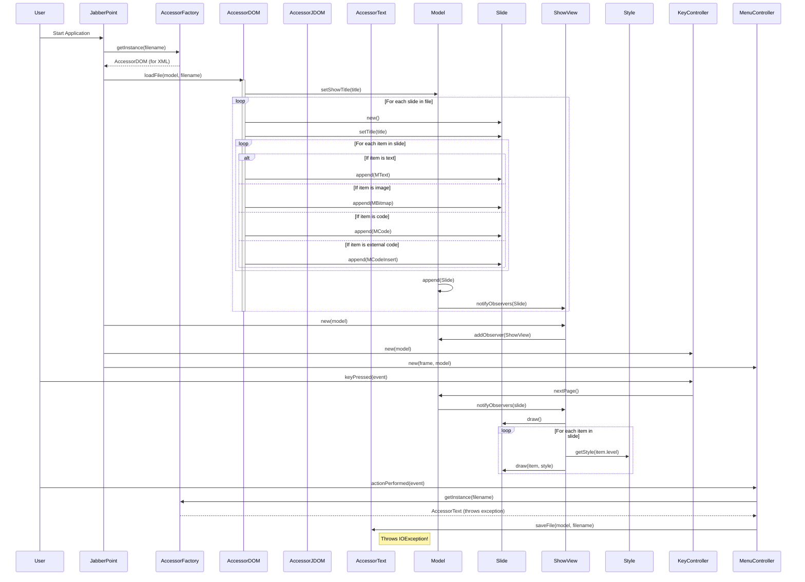

```mermaid
sequenceDiagram
    participant User
    participant JabberPoint
    participant AccessorFactory  
    participant AccessorDOM
    participant AccessorJDOM
    participant AccessorText
    participant Model
    participant Slide
    participant ShowView
    participant Style
    participant KeyController
    participant MenuController

    User->>JabberPoint: Start Application

    JabberPoint->>AccessorFactory: getInstance(filename)
    AccessorFactory-->>JabberPoint: AccessorDOM (for XML)
    
    JabberPoint->>AccessorDOM: loadFile(model, filename)
    activate AccessorDOM
    AccessorDOM->>Model: setShowTitle(title)

    loop For each slide in file
        AccessorDOM->>Slide: new()
        AccessorDOM->>Slide: setTitle(title)

        loop For each item in slide
            alt If item is text
                AccessorDOM->>Slide: append(MText)
            else If item is image
                AccessorDOM->>Slide: append(MBitmap)
            else If item is code
                AccessorDOM->>Slide: append(MCode)
            else If item is external code
                AccessorDOM->>Slide: append(MCodeInsert)
            end
        end

        Model->>Model: append(Slide)
        Model->>ShowView: notifyObservers(Slide)
    end

    deactivate AccessorDOM

    JabberPoint->>ShowView: new(model)
    ShowView->>Model: addObserver(ShowView)

    JabberPoint->>KeyController: new(model)
    JabberPoint->>MenuController: new(frame, model)

    User->>KeyController: keyPressed(event)
    KeyController->>Model: nextPage()
    Model->>ShowView: notifyObservers(slide)
    ShowView->>Slide: draw()
    
    loop For each item in slide
        ShowView->>Style: getStyle(item.level)
        ShowView->>Slide: draw(item, style)
    end

    User->>MenuController: actionPerformed(event)
    MenuController->>AccessorFactory: getInstance(filename)
    AccessorFactory-->>MenuController: AccessorText (throws exception)
    
    MenuController->>AccessorText: saveFile(model, filename)
    Note right of AccessorText: Throws IOException!

```