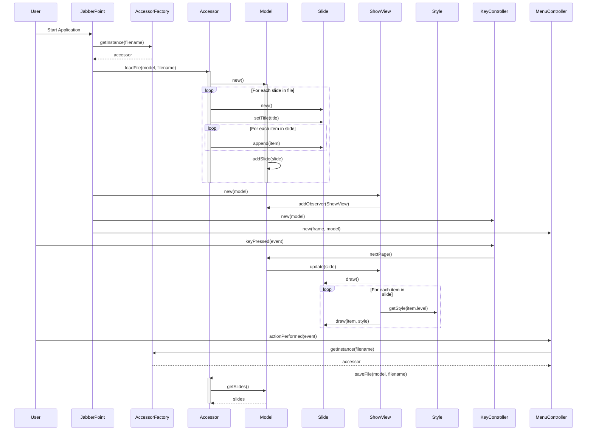

```mermaid
sequenceDiagram
    participant User
    participant JabberPoint
    participant AccessorFactory  
    participant Accessor
    participant Model
    participant Slide
    participant ShowView
    participant Style
    participant KeyController
    participant MenuController

    User->>JabberPoint: Start Application

    JabberPoint->>AccessorFactory: getInstance(filename)
    AccessorFactory-->>JabberPoint: accessor
    
    JabberPoint->>Accessor: loadFile(model, filename)
    activate Accessor
    Accessor->>Model: new()
    activate Model

    loop For each slide in file
        Accessor->>Slide: new()
        Accessor->>Slide: setTitle(title)
        loop For each item in slide
            Accessor->>Slide: append(item)
        end
        Model->>Model: addSlide(slide)
    end

    deactivate Accessor
    deactivate Model

    JabberPoint->>ShowView: new(model)
    ShowView->>Model: addObserver(ShowView)

    JabberPoint->>KeyController: new(model)
    JabberPoint->>MenuController: new(frame, model)

    User->>KeyController: keyPressed(event)
    KeyController->>Model: nextPage()
    Model->>ShowView: update(slide)
    ShowView->>Slide: draw()
    
    loop For each item in slide
        ShowView->>Style: getStyle(item.level)
        ShowView->>Slide: draw(item, style)
    end

    User->>MenuController: actionPerformed(event)
    MenuController->>AccessorFactory: getInstance(filename)
    AccessorFactory-->>MenuController: accessor

    MenuController->>Accessor: saveFile(model, filename)
    activate Accessor
    Accessor->>Model: getSlides()
    Model-->>Accessor: slides
    deactivate Accessor
```